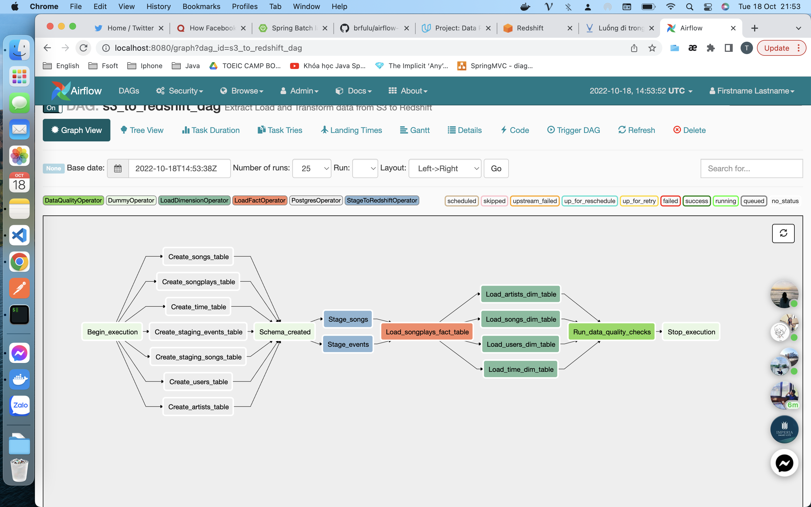
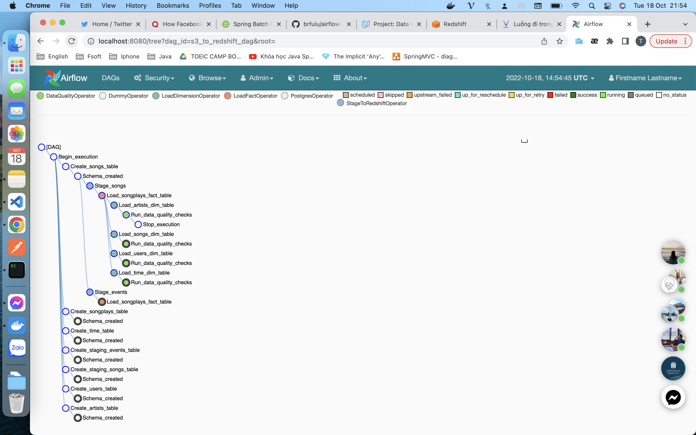

# airflow-data-pipeline

## Introduction

The source data in S3 and needs to be processed in Sparkify's. Datasets consist of JSON logs that tell about user activity in the application and  about the songs the users listen to.



## Getting started

#### Requirements

* Install [Python3](https://www.python.org/downloads/)
* Install [Docker](https://www.docker.com/)
* Install [Docker Compose](https://docs.docker.com/compose/install/)
* [AWS](https://aws.amazon.com/) account and [Redshift](https://aws.amazon.com/redshift/) cluster 

#### Clone repository to local machine
```
git clone https://github.com/affkjuhyt/airflow-data.git
```

#### Change directory to local repository
```
cd airflow-data-pipeline
```

#### Create python virtual environment
```
python3 -m venv venv             # create virtualenv
source venv/bin/activate         # activate virtualenv
pip install -r requirements.txt  # install requirements
```

#### Start Airflow container
```
docker-compose up
```

#### Visit the Airflow UI
Go to http://localhost:8080

Username: user 

Password: password

#### Connect Airflow to AWS

1. Click on the Admin tab and select Connections.

2. Under Connections, select Create.

3. On the create connection page, enter the following values:
- Conn Id: Enter aws_credentials.
- Conn Type: Enter Amazon Web Services.
- Login: Enter your Access key ID from the IAM User credentials.
- Password: Enter your Secret access key from the IAM User credentials.

Once you've entered these values, select Save and Add Another.

4. On the next create connection page, enter the following values:
- Conn Id: Enter redshift.
- Conn Type: Enter Postgres.
- Host: Enter the endpoint of your Redshift cluster, excluding the port at the end.
- Schema: Enter dev. This is the Redshift database you want to connect to.
- Login: Enter awsuser.
- Password: Enter the password you created when launching your Redshift cluster.
- Port: Enter 5439.

Once you've entered these values, select Save.

#### Start the DAG
Start the DAG by switching it state from OFF to ON.

Refresh the page and click on the s3_to_redshift_dag to view the current state.



